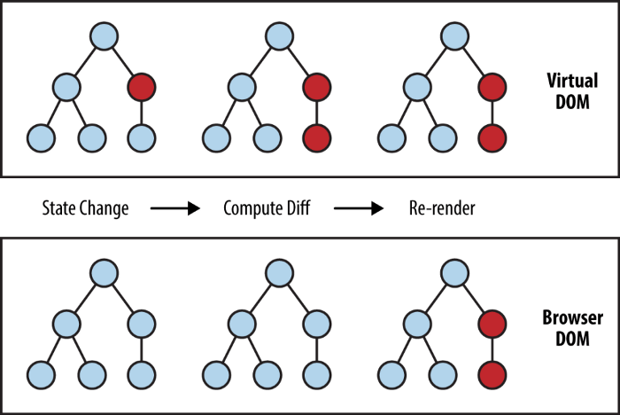

# 1- Introducción a React: DOM y JSX
## 1. DOM de React
### 1.1 DOM
El DOM (Document Object Model) es la representación de la interfaz gráfica o de usuario (en adelante UI) de una aplicación. Cuando el estado de la aplicación cambia, la interfaz también suele hacerlo. Pero el DOM tiene una estructura en forma de árbol que hace que cada vez que modificamos un elemento, todos sus hijos tengan que volver a renderizarse, por lo que modificarlo es costoso a nivel de rendimiento.

### 1.2 VDOM
El VDOM (Virtual DOM) de React es una representación ideal o "virtual" del DOM "real" que se guarda en memoria para sincronizarse con el DOM "real". Es un intermediario entre el DOM de la UI que ve el usuario y el estado de la aplicación. El proceso de sincronización con el DOM "real" se llama reconciliación y se realiza mediante la librería ReactDOM.

### 1.3 Reconciliación
Cada elemento es un nodo en el árbol del DOM. Cada vez que se produce un cambio en cualquier nodo o en la propia estructura del árbol (se añaden o eliminan nodos) se genera un nuevo VDOM. A continuación se compara este VDOM con el DOM "real" y se calcula la forma más óptima de realizar los cambios para renderizar los menores cambios posibles y reducir los costes de rendimiento.

El proceso es el siguiente:

- *State change*: cambio en el nodo de color rojo y generación de un nuevo VDOM.

- *Compute diff*: comparación entre el VDOM y el DOM "real" para detectar los cambios producidos. 

- *Re-render*: consolidación del cambio en el DOM "real". Solo se actualiza lo estrictamente necesario, lo que ha cambiado, no todo el árbol del DOM.
  
## 2. JSX
JSX (JavaScript XML) es una extensión de la sintaxis de JavaScript que se utiliza para describir el aspecto de la UI. 

JSX produce "elementos" de React. Un ejemplo es:

    const element = <h1>Hello, world!</h1>;

### 2.1 Expresiones embebidas en JSX
Pueden embeberse expresiones de JavaScript dentro de JSX utilizando corchetes { }. 

- Por ejemplo una variable: 

        const name = 'Josh Perez';

        const element = <h1>Hello, {name}</h1>;

- Una operación matemática:

        const element = 
{1 + 1} = 2

- O una función:   
  
        function formatName(user) {
        return user.firstName + ' ' + user.lastName;
        }

        const user = {
        firstName: 'Harper',
        lastName: 'Perez'
        };

        const element = (
        <h1>
            Hello, {formatName(user)}!
        </h1>
        );

### 2.2 JSX como una expresión de JavaScript
Después de compilarse, las expresiones de JSX se convierten en expresiones de JavaScript. Por tanto JSX puede utilizarse dentro de condicionales `if`, bucles `for`, asignarse a variables, aceptarse como parámetro y como devolución de una función:

    function getGreeting(user) {
        if (user) {
            return <h1>Hello, {formatName(user)}!</h1>;
        }
        return <h1>Hello, Stranger.</h1>;
    }

### 2.3 Especificar atributos con JSX
Para especificar atributos con JSX pueden utilizarse:

- comillas `" "` para Strings.

        const element = <a href="https://www.reactjs.org"> link </a>;

- corchetes `{} ` para expresiones embebebidas.

        const element = </img>;

**A tener en cuenta**: el DOM de React utiliza la convención `camelCase` para nombrar propiedades en vez de los nombres de los atributos HTML. `class` pasa a ser `className`, `tabindex` pasa a ser `tabIndex`, etc. 

Las etiquetas JSX vacías pueden cerrarse inmediatamente con `/>`:

    const element = ;

Las etiquetas JSX pueden contener etiquetas hijas, pero **siempre** deben depender de una única etiqueta padre:

    const element = (
        

            <h1>Hello!</h1>
            <h2>Good to see you here.</h2>
        

    );

### 2.4 Inyecciones
A diferencia de otros lenguajes, en React es seguro embeber el input que realice un usuario en JSX. El DOM de React escapa todos los valores embebebidos en JSX antes de renderizarlos, evitando las inyecciones y previniendo ataques de *cross-site-scripting*. El siguiente ejemplo no compromete la seguridad de la aplicación:

    const title = response.potentiallyMaliciousInput;
    // This is safe:
    const element = <h1>{title}</h1>;

***

Según: 

https://es.reactjs.org/docs/hello-world.html

https://latteandcode.medium.com/y-eso-del-virtual-dom-de-react-qu%C3%A9-es-3feed6366925
